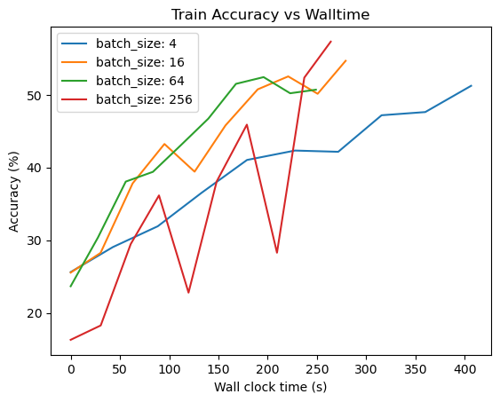

## **Question 1:**

**Q1a. How many trainable parameters does ResNet-152 have? What is the estimated size of the model in MB?**

As the code shown above, the total number of parameters in ResNet-152 is **58,164,298**. The estimated size of the model is **58.16MB**.

**Q1b. Which GPU are you using? How much total memory does it have?**

I am using my local GPU, with total memory of **0.23 GB**.

**Q1c. After you load the model into memory, what is the memory overhead (size) of the CUDA context loaded with the model?**

> Hint - CUDA context size in this example is roughly (total GPU memory utilization - model size)

The memory overhead is about 33.973 MB.

## Question 2:

**2a. What is the total memory utilization during training with SGD, SGD with momentum and Adam optimizers?** Report in MB individually for each optimizer.

- SGD: 4489 MB
- SGD with momentum: 4394 MB
- Adam: 4516 MB

**2b. Which optimizer consumes the most memory? Why?**

> 💡 Hint - refer to the weight update rule for each optimizer. Which one requires the most parameters to be stored in memory?

Adam consumes the most memory. Adam requires more memory because it stores a moving average of the gradients and the squared gradients for each parameter, which requires more memory than SGD and SGD with momentum.

## Question 3:

**3a. What is the memory utilization for different batch sizes (4, 16, 64, 256)? What is the largest batch size you were able to train?**

- Batch size 4: 2918 MB
- Batch size 16: 3622 MB
- Batch size 64: 5270 MB
- Batch size 256: 7818 MB

**3b. Which batch size gave you the highest accuracy at the end of 10 epochs?**

Batch size 256 gave the highest accuracy at the end of 10 epochs.

**3c. Which batch size completed 10 epochs the fastest (least wall clock time)? Why?**

Batch size 256 completed 10 epochs the fastest. This is because larger batch sizes allow for more efficient use of the GPU, as the GPU may spend more time waiting for data to be transferred from CPU to GPU.

**3d. Attach your training accuracy vs wall time plots with your written  submission.**

====== Memory Usage for different batch sizes =======
4	: 2918.0 MB
16	: 3622.0 MB
64	: 5270.0 MB
256	: 7818.0 MB
